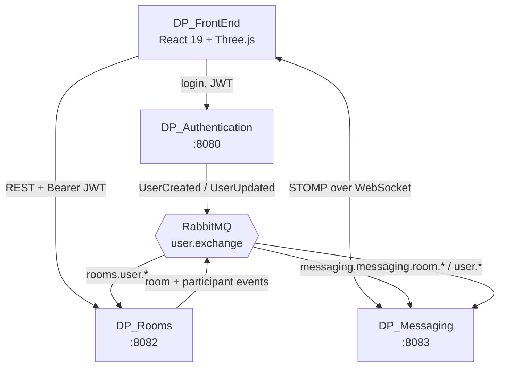
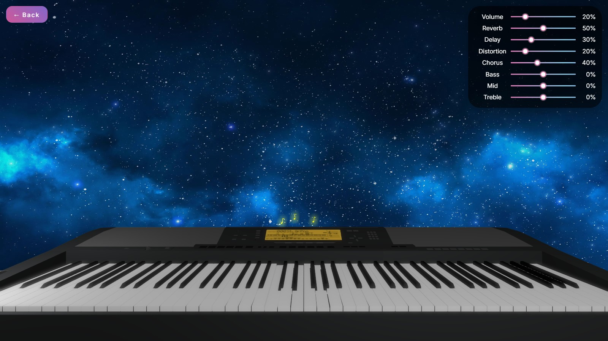
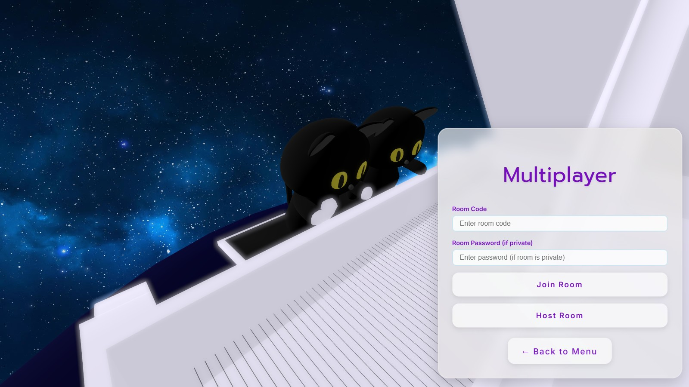

# DP_FrontEnd

**A real-time collaborative 3D piano — play together in the browser.**


🎹 **[Try it live →](https://duopiano.masemharuspex.com/)**


---

## The system

Duo Piano is four services. This repo is the client — the 3D piano you actually play.



Rooms and Messaging never call Auth on the request path. Each keeps a local
read-model projection of users (and, in Messaging, of rooms) built from
RabbitMQ events, and validates incoming JWTs against Auth's public keys. A
slow or restarting auth service cannot stall a piano session.

| Repo | Role | Port |
|---|---|---|
| [DP_Authentication](https://github.com/mkepg/DP_Authentication) | OAuth2 authorization server, user identity | 8080 |
| [DP_Rooms](https://github.com/masem-haruspex/DP_Rooms) | Room lifecycle, participants, moderation | 8082 |
| [DP_Messaging](https://github.com/masem-haruspex/DP_Messaging) | Realtime messaging and live key events | 8083 |
| **DP_FrontEnd** ← you are here | React 19 + React Three Fiber client | — |

## The app



A playable 3D keyboard rendered with React Three Fiber, with a live effects rack
— reverb, delay, distortion, chorus and a three-band EQ — wired into the audio
graph. Press `a`–`j` to play, `1`–`7` to change octave.



Host or join a room by code and every keystroke is shared, so two people play the
same instrument from different machines.

## How it is built

| Concern | Choice |
|---|---|
| Rendering | React Three Fiber + drei + postprocessing, over Three.js |
| Models | Per-key `.glb` meshes under `public/models/`, preloaded before the scene shows |
| Audio | `@tonejs/piano` — sampled piano with an effects chain |
| State | Jotai atoms for client state, TanStack Query for server state |
| Realtime | SockJS + STOMP client to DP_Messaging |
| HTTP | Axios with an interceptor that refreshes the token on 401 and retries |
| Validation | Zod for API responses, DOMPurify for user-supplied text |
| Routing | React Router 7 |
| Animation | Framer Motion for UI, R3F's own loop for the scene |

### Layout

```
src/
  Auth/           login, registration, OAuth popup, token refresh
  Camera/         scripted camera moves between menu and instrument
  Keyboard/       3D key meshes, note mapping, press animation
  AudioControls/  effects rack bound to the Tone.js graph
  Menu/           main menu and settings
  SinglePlayer/   free play, songs, compose
  Multiplayer/    room create/join, participants, chat
  Preloader/      asset loading before first paint
  LoadingScreen/  loading UI
  Toast/          notifications
  atoms/          Jotai state
  lib/            axios instance, STOMP client, helpers
  styles/         SCSS
```

### Talking to the back end

```
DP_Authentication :8080   login, token refresh, profile
DP_Rooms          :8082   create / join / leave rooms
DP_Messaging      :8083   STOMP socket for chat and key events
```

Tokens are obtained via the `password_pkce` grant or a social-login popup, then
attached as a bearer token by the shared Axios instance. On a 401 the interceptor
refreshes once and replays the original request.

## Running locally

Needs **Node 20+** and all three back-end services running.

```bash
npm install
cp .env.example .env.development
npm run dev
```

Point the variables in `.env.development` at your local services (8080, 8082,
8083). `npm run build` type-checks and produces a production bundle;
`npm run lint` runs ESLint.

## Known limitations

- No automated tests.
- WebGL required — the 3D scene will not start on software rendering.
- Audio needs a user gesture before it can begin, hence the click-to-start screen.

## Status

Part of [Duo Piano](https://duopiano.masemharuspex.com/), a personal project
currently live. All rights reserved — published to be read, not reused.
